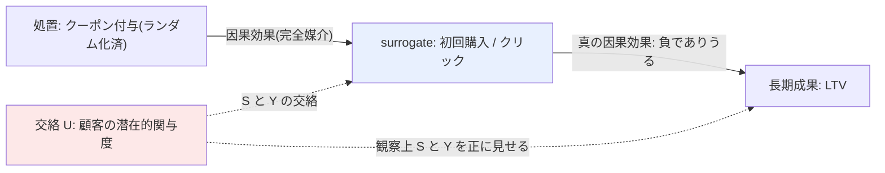

# 03. Long-Term Causal Inference with Imperfect Surrogates using Many Weak Experiments, Proxies, and Cross-Fold Moments

[← index](index.md)

## 書誌情報

| 項目 | 内容 |
|------|------|
| 著者 | Aurélien Bibaut, Nathan Kallus, Simon Ejdemyr, Michael Zhao |
| 年 | 2023 |
| 会場 | arXiv (stat.ME — Statistics > Methodology)。査読付き論文誌・会議への掲載は **未確認** |
| リンク | [arXiv:2311.04657](https://arxiv.org/abs/2311.04657) |

**関連論文（確認済み）**

| 項目 | 内容 |
|------|------|
| タイトル | Nonparametric Jackknife Instrumental Variable Estimation and Confounding Robust Surrogate Indices |
| 著者 | Aurélien Bibaut, Nathan Kallus, Apoorva Lal |
| 年 | 2024（2024 年 6 月 20 日提出、2024 年 10 月 7 日改訂） |
| リンク | [arXiv:2406.14140](https://arxiv.org/abs/2406.14140) |

**確認状況**: 両論文とも著者・タイトル・年・abstract の主要部分を arXiv から確認済み。本文 PDF は未取得のため、**定理番号・仮定の正式な番号付け・具体的な実験結果の数値は未確認**。以下の定式化は abstract の記述に基づく再構成である。

## 一言で言うと

**処置がランダム化されており、かつ surrogate が処置の成果への効果を完全に媒介していてさえ、surrogate と成果の間の交絡によって因果効果の符号を取り違え得る** —— これが surrogate paradox。多数の過去実験を surrogate に対する操作変数として使い、JIVE 系の cross-fold 手続きでこのバイアスを除去する。

## 問題設定

abstract の第一文が本論文の全てを規定している。

> "Inferring causal effects on long-term outcomes using short-term surrogates is crucial to rapid innovation. However, even when treatments are randomized and surrogates fully mediate their effect on outcomes, it's possible that we get the direction of causal effects wrong due to confounding between surrogates and outcomes -- a situation famously known as the surrogate paradox."

ここで決定的に重要なのは **"even when treatments are randomized and surrogates fully mediate their effect on outcomes"** という条件節である。すなわち、

- 処置はランダム化されている（$W \perp\!\!\!\perp$ 全ての交絡因子）
- surrogate は処置の成果への効果を **完全に媒介** している（= [01](01-the-surrogate-index.md) の Prentice surrogacy assumption が成立）

**この 2 つが両方成り立っていても、符号を誤り得る。**

これは [01](01-the-surrogate-index.md) の枠組みに対する根本的な警告である。原典の仮定を満たすことは安全性を保証しない。理由は $S$ と $Y$ の間の交絡にあり、これは surrogacy assumption（$Y \perp\!\!\!\perp W \mid S, X$）とは**別の仮定**だからである。

### なぜ surrogacy を満たしても符号が反転するのか

surrogacy assumption は $W$ と $Y$ の関係についての条件であり、$S$ と $Y$ の関係については何も言っていない。ところが surrogate index $h(s) = \mathbb{E}[Y \mid S = s]$ の学習は **$S$ と $Y$ の観察上の関係** に依存する。この関係が交絡していれば、$h$ は $S$ が $Y$ に及ぼす**因果的**な効果ではなく、**相関的**な関係を学習してしまう。

構造を図示すると以下になる。

**本課題での具体例（安売り常連化）**:

1. 観察データでは「初回購入した顧客は LTV が高い」という強い正の相関がある。これは **関与度の高い顧客が初回購入もするし LTV も高い**（$U \to S$ かつ $U \to Y$）ことによる交絡である。
2. したがって $h$ は「初回購入 → LTV は正」と学習する。
3. クーポン施策は初回購入を増やす（$W \to S$ は正、ランダム化済みなので正しく推定される）。
4. surrogate index はこれらを合成し「クーポンは LTV を上げる」と結論する。
5. **しかし実際には**、クーポン経由で誘発された初回購入は価格反応であり、価格参照点を下げて LTV を **毀損** する。$S \to Y$ の真の因果効果は負である。
6. → **符号が反転する。**

この機序において surrogacy assumption（クーポンの LTV への効果はすべて初回購入を経由する）は成立していてよい。壊れているのは $S \to Y$ の識別であって、$W \to Y$ の媒介ではない。**gather 段階の論点 2（符号の一貫性）と論点 3（交絡の非存在）は独立の問題ではなく、後者が前者を引き起こす**というのが本論文の指摘である。

## 手法

### 記法

- $e = 1, \dots, E$: 過去実験のインデックス
- $Z_e$: 実験 $e$ における処置割当（操作変数として使う）
- $S$: surrogate ベクトル
- $Y$: 長期成果
- $\beta$: $S$ から $Y$ への構造的（因果的）パラメータ

### 中核のアイデア: 過去実験を操作変数として使う

$S \to Y$ の交絡を迂回するには、$S$ を外生的に動かす変動源が要る。**ランダム化された過去実験の処置割当 $Z_e$ はまさにそれである**。

- $Z_e$ はランダム化されている → $U$ と独立（IV の外生性）
- $Z_e$ は $S$ を動かす → 関連性
- $Z_e$ は $S$ を通してのみ $Y$ に効く（完全媒介の仮定） → 除外制約

したがって $Z_e$ を操作変数として $S \to Y$ の構造的関係を推定できる。abstract の記述は "leverages multiple historical experiments as instrumental variables, which helps bypass surrogate confounding despite bounded experiment sizes"。

**この構造の含意は重大である。surrogate index の学習は、[01](01-the-surrogate-index.md) が想定するような「観察データでの単純回帰」ではなく、「過去実験を IV とした IV 回帰」であるべきだ**ということになる。そして IV 回帰には **実験が必要** である。→ これが本課題のパラドックスを最も鋭い形で突きつける（→ [index](index.md#低頻度性のパラドックス-と-突破口)）。

2 段階最小二乗（2SLS）の形で書けば、

$$
\hat\beta_{\text{2SLS}} \;=\; \left( \hat{S}^\top \hat{S} \right)^{-1} \hat{S}^\top Y, \qquad \hat{S} = P_Z S
$$

ここで $P_Z = Z(Z^\top Z)^{-1} Z^\top$ は $Z$ への射影行列である。

### many weak instruments 問題と JIVE

ここで本論文の技術的核心が現れる。個々の過去実験は **metric をほとんど動かさない**（"individual experiments barely move metrics"）。すなわち各 IV は **弱い**。多数の弱い IV がある状況では、標準的な 2SLS は **消えないバイアス**（non-vanishing bias）を持つ。これは第 1 段階の予測値 $\hat{S}_i$ が、自分自身の観測 $S_i$ を含んで構成されるために生じる（自己参照によるオーバーフィッティング）。

**JIVE（Jackknife Instrumental Variables Estimation）** の解決策は単純である。個体 $i$ の第 1 段階予測値を、**個体 $i$ を除外して**推定する。

$$
\hat{S}_i^{(-i)} \;=\; Z_i^\top \hat\pi^{(-i)}
$$

ここで $\hat\pi^{(-i)}$ は個体 $i$ を除いたサンプルで推定した第 1 段階係数。これにより自己参照が断たれ、バイアスが除去される。abstract の記述は "employs cross-fold procedures (JIVE is cited as an example) to eliminate non-vanishing bias that plagues standard two-stage least squares when individual experiments barely move metrics"。

**cross-fold moments** はこの jackknife の考え方を一般化したもので、モーメント条件の評価を fold 分割によって行い、nuisance の推定と評価に同じデータを使わないようにする（cross-fitting と同系統の発想）。

### surrogacy assumption の緩和: proxies と effect leakage

本論文はさらに **完全媒介の仮定を超える**（"extends beyond perfect mediation by incorporating proxies"）。すなわち [01](01-the-surrogate-index.md) の

$$
Y \;\perp\!\!\!\perp\; W \;\bigm|\; S, X
$$

が成り立たず、処置が $S$ を経由しない直接経路を持つ場合（**effect leakage**）も扱う。abstract の記述は "addressing both confounding and incomplete effect mediation violations"。本課題での effect leakage は **クーポンが「この店は値引きする」という認識を植え付け、短期指標を経由せず直接に将来の定価購買意欲を下げる経路** に対応する。gather の論点 1 そのものである。

この 2 種類の違反（交絡 + 不完全媒介）を同時に扱う点が、[01](01-the-surrogate-index.md) に対する本論文の主要な拡張にあたる。

### 後続研究 (arXiv:2406.14140)

Bibaut, Kallus, Lal (2024) は JIVE を **ノンパラメトリック** 設定へ拡張する。

- 多数の弱い IV があるノンパラメトリック設定へ JIVE を拡張
- **IV splitting** の機構を導入してバイアスを除去
- 仮説クラスの複雑度に依存する学習率を確立
- 「短期 surrogate から予測される長期成果に対する平均処置効果」のセミパラメトリック推論に応用
- **"using historical experiments as IVs to learn this nonparametric predictive relationship even in the presence of confounding between short- and long-term observations"**
- 漸近正規な推定値を与え、推論に使える

線形性を仮定しない分、本課題のような非線形な購買行動には適合しやすい可能性があるが、その分だけ多くのデータを要する。

## 実験・結果

| 項目 | 内容 |
|------|------|
| 主張された成果 | 新しい実験について、**長期成果が観測される前に**長期効果の妥当な信頼区間を構成できる |
| 手法の構成要素 | many weak experiments as IVs / proxies / cross-fold moments（JIVE） |
| 対処する違反 | (1) surrogate と outcome の交絡、(2) 不完全媒介（effect leakage） |

**未確認**: 実証評価の対象データ（Netflix データが使われている可能性が高いが確認できていない）、実験本数 $E$ の実数、バイアス除去の定量的効果、信頼区間の被覆率、既存手法との比較結果。いずれも abstract に記載がなく本文未取得のため **未確認**。著者陣に Netflix 所属と思われる研究者（Simon Ejdemyr, Michael Zhao — [02](02-netflix-200-ab-tests.md) の共著者でもある）が含まれるため Netflix データの利用が推測されるが、**これは推測であり確認事項ではない**。

## 本課題への適用可能性

### 効く点

**1. 本課題で最も現実的かつ致命的な失敗モードを正面から扱う唯一の論文**

安売り常連化 = surrogate paradox という対応は、本課題における理論と実務の最も鮮明な接点である。「クリック率は上がったが LTV は下がった」は割引施策で **構造的に起こり得る**（値引きが顧客の価格参照点を下げる限り必然的に）。本論文はその機序を形式化している。

**2. 「surrogacy を満たしても符号を誤る」という指摘が検証設計を規定する**

これは本課題の検証計画に対する最も重要な設計制約である。$Y \perp\!\!\!\perp W \mid S, X$ の検証だけでは **不十分** であり、$S \to Y$ の交絡を別途扱わねばならない。この認識なしに [01](01-the-surrogate-index.md) を実装すると、**「仮定は検証した」と信じたまま符号を誤る**という最悪の失敗をする。

**3. 過去施策の蓄積を資産化する方向性**

「多数の弱い実験を IV として使う」という発想は、**過去施策のログそのものが surrogate index の学習資源になる**ことを意味する。低頻度でも年単位で蓄積すれば本数は増える（年 4 回 × 5 年 = 20 本）。C1（Data Fusion）と直接補完する。

**4. 「弱い実験」という前提が本課題と親和的**

本論文は個々の実験が metric をほとんど動かさないことを **前提として設計されている**。これは本課題（小規模施策、効果量が小さい）の状況そのものである。強い実験を前提とする手法より適合性が高い。ここは数少ない本課題にとっての追い風である。

**5. effect leakage への対処が gather の論点 1 に対応する**

不完全媒介を許容する枠組みは、「クーポンが価格期待を直接変える」経路を明示的に扱える。完全媒介を要求する [01](01-the-surrogate-index.md) より本課題の現実に近い。

### 効かない/リスク点

**1. 「多数の実験」が前提 —— 本課題のパラドックスがここで最も鋭い**

本論文は「many weak experiments」を IV として使う。IV の識別力は実験本数 $E$ に依存し、**$E$ が小さいと IV が弱すぎて何も識別できない**。本課題では $E$ が一桁である。

さらに悪いことに、本論文の設定は 3 つの困難を同時に抱えている。

| 条件 | 本論文の想定 | 本課題 | 判定 |
|------|------------|--------|------|
| 実験の**本数** $E$ | many（多数） | 一桁 | ✗ |
| 各実験の**強さ** | weak（弱い） | 弱い | ○ |
| 実験の**均質性** | 同一プロダクト上の変更 | 対象・訴求・金額が毎回違う | ✗ |

「弱い」ことは想定内だが、「少ない」ことは想定外である。**many weak ≠ few weak**。few weak experiments では JIVE の漸近論（$E \to \infty$ を要する）が働かない。本論文は本課題のパラドックスを解決するのではなく、**パラドックスがなぜ本質的に困難かを説明している**と読むべきである。

**2. IV の除外制約が施策の異質性で壊れる**

複数の過去施策を IV として束ねるには、**それらが同じ $S \to Y$ 構造を共有している**必要がある。ところが本課題では施策ごとに対象ユーザー・訴求・クーポン額が異なる。クーポン施策とプロモメール施策では媒介構造が違う可能性が高く、これらを同じ IV セットとして束ねると **除外制約が破れる**。少数の実験を無理に束ねてバイアスを増やす、という本末転倒が起こり得る。

**3. 交絡の方向が「都合の悪い側」に偏っている**

一般論として交絡はどちらの方向にも働き得るが、本課題では **交絡は一貫して正のバイアスを生む**。関与度の高い顧客ほど開封もクリックも初回購入もし、かつ LTV も高い。したがって観察データで学習した $h$ は **$S \to Y$ の効果を系統的に過大評価する**。これは「符号を誤る確率が 50% ずつ」ではなく、**楽観方向に誤る確率が高い**ことを意味する。施策を過大評価して打ち続ける、という失敗モードに構造的に傾いている。

**4. 検証手段自体が実験を要するという再帰**

本論文の手法は「$S \to Y$ の交絡を IV で除去する」ものだが、その IV が実験である。すなわち **交絡を検証・除去するために実験が要る**。観察データをいくら積んでも $S \to Y$ の交絡は識別できない（それが交絡の定義である）。これが [01](01-the-surrogate-index.md) の「突破口は半分しか救わない」の理論的根拠にあたる。

**5. 実装難度が高い**

JIVE / cross-fold moments / ノンパラメトリック IV は実装・デバッグ・診断のいずれも難しい。少数実験下では推定値が不安定になり、その不安定性が手法のバグなのかデータの限界なのかの切り分けが困難である。公開実装は **未確認**（[04](04-persistent-confounding.md) は GitHub 実装があるが、本論文については確認できていない）。

**6. 本課題にとっての現実的な使い道は「手法」ではなく「診断基準」かもしれない**

以上を踏まえると、本論文の手法を本課題でそのまま動かすことは当面困難である。しかし本論文が与える **診断的な問い** は実験本数によらず有効である。

> 観察データで見える $S \to Y$ の正の関係のうち、どれだけが交絡由来か？

この問いに定量的に答えられなくとも、**答えられないという事実を認識した上で意思決定する**ことには価値がある。→ 実装ステップ 5 の感度分析。

## 実装ステップ

1. **本文 PDF の入手**: many weak experiments の「many」がどの程度の $E$ を想定しているか（漸近論が働き始める本数の目安）を確認する。これが本課題での適用可否を直接決める。実証評価の設定も確認する。

2. **交絡の方向と大きさを可視化する（実験不要・最優先）**: 観察データで、$S$（初回購入・初月購買額）と $Y$（6 ヶ月 LTV）の関係を、**関与度の代理変数**（会員年数、施策前の購買頻度、RFM スコア）で層別して描く。層別で関係が大きく変わるなら、$S \to Y$ の観察上の関係は交絡に強く汚染されている。これは実験ゼロでできる最も情報量の多い診断である。

3. **クーポン経由と自然発生の $S$ を分けて $Y$ を比較する（最重要）**: 同じ「初回購入」でも、クーポン経由か否かで $Y$ の分布が違うかを見る。

   $$\mathbb{E}[Y \mid S = s, \text{クーポン経由}] \;\overset{?}{=}\; \mathbb{E}[Y \mid S = s, \text{自然発生}]$$

   **左辺が有意に小さければ、それが安売り常連化の直接的な証拠**であり、surrogate index の適用を止める根拠になる。ただしこの比較自体が観察的であり交絡している（クーポンを受け取る顧客は無作為ではない）点に注意。過去にランダム化した施策があるなら、そこで見る。

4. **過去施策を IV として棚卸しする**: 何本の施策がランダム化されており、$S$ と $Y$ の両方が観測されているかを数える。**$E$ が一桁なら本論文の手法は諦める**。ここで正直な数え上げをすることが、無理な適用を防ぐ。

5. **感度分析に切り替える**: $E$ が足りない場合、点推定を諦めて **「$S \to Y$ の交絡がどの程度強ければ結論が反転するか」** を計算する。Rosenbaum 型の感度分析の発想。「関与度による交絡が観察された関係の 30% を説明するなら符号が反転する」といった形の記述は、実験本数によらず得られ、意思決定に直接使える。**少数実験下での現実的な落とし所はここにある。**

6. **符号反転を運用で検知する体制を作る**: → [index の「surrogate paradox の検知方法」](index.md#surrogate-paradox-の検知方法)。手法で防げないなら、**長期成果が確定した時点での事後検証を必ず回す**。少数実験でも、1 本ずつ答え合わせを蓄積することが唯一の道である。

7. **ホールドアウトを常設する**: 各施策で一定割合を非処置のまま保持し、長期成果まで追跡する。surrogate index を使って早期に判断しつつ、**答え合わせの材料を必ず残す**。これは本課題における最も重要な運用設計であり、少数実験を「毎回 1 本ずつ増やす」ための唯一の仕組みである。

## 関連リソース

- [01. The Surrogate Index](01-the-surrogate-index.md) — 本論文が批判的に検討する原典。原典の仮定を満たしても符号を誤り得るという関係。**必ずセットで読む**。
- [02. Evaluating the Surrogate Index Using 200 A/B Tests at Netflix](02-netflix-200-ab-tests.md) — Kallus / Zhao が共著。実証的な「概ね合う」の裏側を本論文が理論的に扱う。
- [04. Long-term Causal Inference Under Persistent Confounding](04-persistent-confounding.md) — 同じく Kallus 共著。本論文が $S \to Y$ の交絡を IV で扱うのに対し、04 は短期成果の逐次構造で識別する。**同じ問題への別のアプローチ**であり、実験本数が足りない本課題では 04 の方が実行可能性が高い可能性がある。
- [arXiv:2406.14140 — Nonparametric JIVE and Confounding Robust Surrogate Indices](https://arxiv.org/abs/2406.14140)（Bibaut, Kallus, Lal, 2024） — 本論文のノンパラメトリック拡張。確認済み。
- [arXiv:2604.14352 — PROXIMA](https://arxiv.org/abs/2604.14352) — directional accuracy を独立した診断次元として測る。本論文が理論的に扱う符号反転の、運用上の検知手段。
