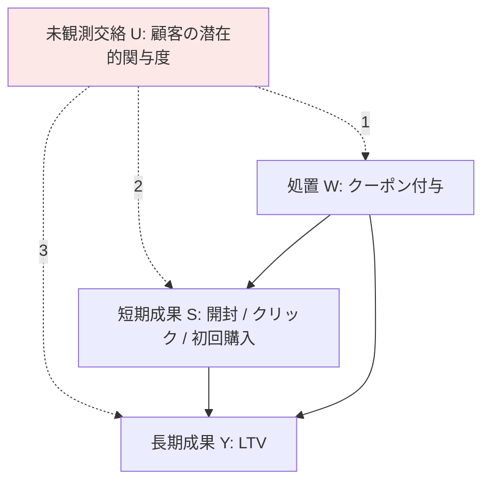

# 04. Long-term Causal Inference Under Persistent Confounding via Data Combination

[← index](index.md)

## 書誌情報

| 項目 | 内容 |
|------|------|
| 著者 | Guido Imbens, Nathan Kallus, Xiaojie Mao, Yuhao Wang |
| 年 | arXiv 初版 2022 年 2 月 15 日 / 論文誌掲載 2025（オンライン公開 2024 年 10 月 5 日） |
| 会場 | **Journal of the Royal Statistical Society Series B: Statistical Methodology**, Vol. 87, Issue 2, pp. 362–388 (2025) |
| DOI | [10.1093/jrsssb/qkae095](https://doi.org/10.1093/jrsssb/qkae095) |
| リンク | [arXiv:2202.07234](https://arxiv.org/abs/2202.07234) / [JRSS-B](https://academic.oup.com/jrsssb/article/87/2/362/7811312) / [GitHub: CausalML/LongTermCausalInference](https://github.com/CausalML/LongTermCausalInference) |

**確認状況**: 著者・タイトル・abstract・arXiv バージョン履歴（v1: 2022-02-15, v2: 2022-03-16, v3: 2023-08-17, v4: 2024-05-14, v5: 2024-08-31）を確認済み。JRSS-B の巻・号・ページ・DOI・年は Oxford Academic のページから確認済み。**本文 PDF は未取得のため、3 つの識別戦略の具体的な内容・定理番号・仮定の正式な番号付け・実験結果の数値は未確認**。GitHub 実装の存在は gather 段階の記載に基づき、リポジトリの中身は **未確認**。

## 一言で言うと

処置・短期成果・長期成果の **すべてに同時に影響する未観測交絡因子（persistent confounder）** は、既存の long-term causal inference の識別戦略をすべて無効化する。本論文は **複数の短期成果の逐次構造（sequential structure）** を利用して、この状況下でも平均長期処置効果を識別する 3 つの戦略を与える。

## 問題設定

### データ構造

abstract が明示する設定は本課題のデータ状況と構造的に一致する。

> "We study the identification and estimation of long-term treatment effects when both experimental and observational data are available. Since the long-term outcome is observed only after a long delay, it is not measured in the experimental data, but only recorded in the observational data. However, both types of data include observations of some short-term outcomes."

| データ | 処置 $W$ | 短期成果 $S$ | 長期成果 $Y$ |
|--------|---------|-------------|-------------|
| 実験データ（experimental） | ○ 観測（ランダム化） | ○ 観測 | ✗ **未観測**（遅延のため） |
| 観察データ（observational） | ○ 観測 | ○ 観測 | ○ 観測 |

本課題への対応。

| データ | 内容 |
|--------|------|
| 実験データ | 直近のクーポン施策の A/B テスト。処置割当と施策後 2〜4 週の短期指標は取れるが、LTV はまだ確定していない |
| 観察データ | 過去顧客の購買履歴。短期指標も LTV も確定しているが、処置はランダム化されておらず交絡している |

**両データが短期成果 $S$ を共有している**ことが data combination を可能にする蝶番である。

### 中核の困難: persistent confounding

> "In this paper, we uniquely tackle the challenge of persistent unmeasured confounders, i.e., some unmeasured confounders that can simultaneously affect the treatment, short-term outcomes and the long-term outcome, noting that they invalidate identification strategies in previous literature."

**persistent confounder** $U$ とは、以下の 3 つすべてに同時に影響する未観測変数である。

1. 処置 $W$
2. 短期成果 $S$
3. 長期成果 $Y$

「もともと熱心な顧客」がまさにこれである。関与度の高い顧客は、

1. 過去にクーポンを受け取りやすい（配信ロジックが優良顧客を狙う）→ $U \to W$
2. 開封もクリックもしやすい → $U \to S$
3. LTV も高い → $U \to Y$

**gather 段階の論点 3 が指摘する通り、これはマーケティングで最も現実的な仮定違反**である。そして abstract が明言する通り、これは **先行文献の識別戦略を無効化する**（"invalidate identification strategies in previous literature"）。[01](01-the-surrogate-index.md) の surrogate index も、$U$ が観察データ側で $S$ と $Y$ の両方に効いていれば $h$ の学習が汚染される。

### [03](03-imperfect-surrogates-many-weak-experiments.md) との関係

両論文は同じ病（$S$ と $Y$ の交絡）に対する **異なる処方** である。

| | [03](03-imperfect-surrogates-many-weak-experiments.md) Imperfect Surrogates | 04 Persistent Confounding |
|---|---|---|
| 交絡を断つ手段 | **多数の過去実験を IV として使う** | **複数短期成果の逐次構造を使う** |
| 必要な資源 | many weak experiments（多数の実験） | 複数時点の短期成果（1 実験でよい） |
| 本課題での実行可能性 | ✗ 実験が一桁 | ○ **時系列の短期指標は取れる** |

**この違いが本課題にとって決定的である**。04 は「実験の本数」ではなく「短期成果の時点数」を資源として要求する。年 2〜4 回しか施策を打てなくとも、**1 回の施策で週次・日次の短期指標を複数時点取ることはできる**。→ [index](index.md#低頻度性のパラドックス-と-突破口) で詳述。

## 手法

### 記法

- $W \in \{0,1\}$: 処置
- $S = (S_1, S_2, \dots, S_T)$: **逐次的に観測される** 複数の短期成果
- $Y$: 長期成果
- $U$: persistent unmeasured confounder
- $G \in \{E, O\}$: 実験サンプル / 観察サンプル

### 標準的な surrogacy が壊れる理由の形式化

[01](01-the-surrogate-index.md) の Prentice surrogacy assumption は

$$
Y \;\perp\!\!\!\perp\; W \;\bigm|\; S, X
$$

を要求する。しかし persistent confounder $U$ があると、観察データ上で

$$
\mathbb{E}\!\left[\,Y \mid S = s, X = x, G = O\,\right] \;\neq\; \mathbb{E}\!\left[\,Y \mid \mathrm{do}(S = s), X = x\,\right]
$$

となり、$h(s,x)$ の学習が $U$ による交絡で汚染される。さらに $U \to W$ があるため観察データでの処置効果も識別できない。実験データには $Y$ がないため、実験データ単独でも識別できない。**どちらのデータ単独でも識別できず、素朴な結合も機能しない**というのが困難の構造である。

### 3 つの識別戦略: 逐次構造の活用

> "To address this challenge, we exploit the sequential structure of multiple short-term outcomes, and develop three novel identification strategies for the average long-term treatment effect."

**中核のアイデア**（abstract から読み取れる範囲）: 短期成果は単一のベクトルではなく **時間順序を持つ系列** $S_1 \to S_2 \to \dots \to S_T$ である。この逐次構造は追加の情報を与える。$U$ が持続的（persistent）であるがゆえに、$U$ は $S_1, S_2, \dots$ のすべてに影響する。すると **早い時点の短期成果が、後の時点の関係における $U$ の代理として機能し得る**。時系列の内部構造が交絡の識別に使える、という発想である（proximal causal inference / negative control の系譜と親和的だが、本論文がその枠組みを明示的に採るかは **未確認**）。

$$
\tau \;=\; \mathbb{E}\!\left[\,Y(1) - Y(0)\,\right]
$$

を、$U$ を観測せずに $(W, S_1, \dots, S_T)$ と 2 つのデータソースから識別する。

**未確認**: 3 つの識別戦略それぞれの具体的な仮定・識別式・相互の関係（どれがどの状況で使えるか）は abstract に記載がなく、本文未取得のため確認できていない。**本論文を本課題に適用する上で最も重要な情報がここであり、PDF の精読が必須である。**

### 推定

> "We further propose three corresponding estimators and prove their asymptotic consistency and asymptotic normality."

3 つの識別戦略それぞれに対応する推定量を提案し、漸近一致性と漸近正規性を証明している。漸近正規性があるため信頼区間の構成が可能であり、実務での推論に使える。

**未確認**: 推定量の具体形、要求されるサンプルサイズ、cross-fitting の要否、多重ロバスト性の有無。

## 実験・結果

| 項目 | 内容 |
|------|------|
| 適用対象 | 職業訓練プログラム（job training program）の長期雇用への効果 |
| データ | **semi-synthetic data**（半合成データ） |
| 主張された結果 | persistent confounder を扱えない既存手法を数値的に上回る（"outperform existing methods that fail to handle persistent confounders"） |

**注意すべき点**: 評価が **semi-synthetic data** で行われている。これは真の効果が既知でなければ手法の優劣を測れないためであり、方法論研究として妥当な設計である。しかし **実データでの検証ではない**ため、実務性能の証拠としては [02](02-netflix-200-ab-tests.md) の Netflix 研究（1098 の実テストアーム）より弱い。理論的保証は 04 の方が強く、実務での実証は 02 の方が強い、という補完関係にある。

**未確認**: 比較対象の既存手法、性能差の定量的な大きさ、サンプルサイズ、semi-synthetic データの生成過程。

## 本課題への適用可能性

### 効く点

**1. 本課題で最も現実的な仮定違反を正面から扱う**

「もともと熱心な顧客」による persistent confounding は、マーケティングにおいて **例外ではなく常態** である。特に本課題ではクーポン配信の対象選定自体が顧客特性に依存する（$U \to W$）ため、3 つの矢印すべてが実在する。この設定を扱う手法は必須であって選択肢ではない。

**2. 必要な資源が「実験の本数」ではなく「短期成果の時点数」である —— 本課題にとって決定的**

これが本論文の本課題における最大の価値である。[03](03-imperfect-surrogates-many-weak-experiments.md) が many weak experiments を要求するのに対し、04 は **1 つの実験でも、短期成果が複数時点で取れれば識別できる**（少なくとも識別戦略の構造上はそう読める）。

本課題では施策は年 2〜4 回しか打てないが、**1 回の施策の後に日次・週次の行動ログを取ることは何のコストもかからない**。$S_1$ = 第 1 週の購買、$S_2$ = 第 2 週の購買、… という系列は既に手元にある（あるいは容易に構成できる）。

> 低頻度性が制約するのは施策の **本数** であって、1 施策あたりの **観測の細かさ** ではない。04 は後者を資源とする。

**この非対称性が本課題における突破口の中核である**（→ [index](index.md#低頻度性のパラドックス-と-突破口)）。

**3. データ構造が本課題と一致する**

「実験データには $Y$ がない、観察データには $Y$ がある、両者は $S$ を共有する」という設定は、本課題のデータ状況そのものである。特別な読み替えを要しない。

**4. JRSS-B 掲載による理論的信頼性**

Vol. 87, Issue 2, pp. 362–388 (2025) として掲載されており、統計方法論のトップジャーナルの査読を通過している。[03](03-imperfect-surrogates-many-weak-experiments.md)（arXiv のみ、掲載 **未確認**）と比べ、理論の正しさに対する外部保証が強い。実務で手法を採用する際の社内説明でも通りやすい。

**5. 公開実装が存在する**

[CausalML/LongTermCausalInference](https://github.com/CausalML/LongTermCausalInference) が公開されている（**リポジトリの中身は未確認**）。理論の理解と手を動かした検証を並行できる。本課題の 4 本の中で、実装可能性が最も高い候補である。

**6. 著者陣の一貫性**

Imbens は [01](01-the-surrogate-index.md) の共著者、Kallus は [02](02-netflix-200-ab-tests.md)・[03](03-imperfect-surrogates-many-weak-experiments.md) の共著者である。この系譜が原典の限界を自ら認識して緩和方向に進んでいることが著者の重なりから読み取れる。**原典の楽観を原典の著者自身が修正している**という事実は、[01](01-the-surrogate-index.md) 単体での運用を避けるべき根拠になる。

### 効かない/リスク点

**1. 「逐次構造」の要件がマーケティングデータで満たされるかは未検証**

本論文が要求するのは単に「短期成果が複数ある」ことではなく、**特定の逐次構造**（sequential structure）である。3 つの識別戦略それぞれが逐次構造にどのような仮定を置くかが **未確認** である以上、本課題の短期指標系列（週次購買額）がその要件を満たすかは判定できない。

特に懸念されるのは、識別が $U$ の **持続性の形**（$U$ が時間を通じて一定か、どう影響するか）に依存する可能性である。本課題の「関与度」は施策そのものによって変化し得る（クーポンが関与度を変える）ため、$U$ を時間不変の潜在変数として扱えるかは自明でない。**PDF 精読前にこの点を楽観してはならない。**

**2. 職業訓練と割引施策の構造的な差**

適用例は職業訓練であり、短期成果（四半期ごとの雇用・所得）は **単調に蓄積する** 性質を持つ。対して本課題の週次購買は、**クーポンの使用期限で人為的に区切られる**（期限直前に駆け込み購買が集中し、期限後に反動で落ちる）。この非定常性が逐次構造の仮定と整合するかは不明である。

**3. semi-synthetic 評価しかない**

実データでの検証がないため、実務での性能は未知数である。[02](02-netflix-200-ab-tests.md) のような「意思決定の一致率」の証拠がない。理論的に正しい手法が実務で機能するとは限らない、というのは C5 全体を貫く論点である。

**4. surrogate paradox を解決するわけではない**

本論文が扱うのは **識別** の問題であり、$U$ を適切に扱えば符号も正しく推定されるはずである。しかしそれは **本論文の仮定が正しければ** の話である。仮定が破れた場合に符号が保存されるという保証はない。[03](03-imperfect-surrogates-many-weak-experiments.md) の警告（surrogacy を満たしても符号を誤る）は本論文にも別の形で及ぶ。**04 を実装したからといって符号の事後検証を省略してはならない。**

**5. 観察データ側の $W$ の記録品質**

本論文の設定では観察データに処置 $W$ が記録されている（表の通り）。本課題で過去の施策ログが処置割当を正確に記録しているかは、実務上しばしば怪しい。記録が不完全なら、処置割当が観測されない設定を扱う proximal surrogate index（gather の 05、[arXiv:2601.17712](https://arxiv.org/abs/2601.17712)）の方が適合する可能性がある。**まず自社のログ品質を確認することが手法選択の前提になる。**

**6. 実装の難度と検証の困難**

3 つの識別戦略のどれを使うかの判断自体が仮定の判断であり、データからは決められない。少数実験下では推定値が不安定になり、その不安定性の原因切り分けが難しい。公開実装があってもハイパーパラメータ・モデル選択の余地は残る。

**7. 平均効果のみで異質性を扱わない**

abstract は "average long-term treatment effect" を対象とする。uplift モデリングの本質は **異質性の推定**（誰にクーポンを送るか）であり、平均効果だけでは本課題の最終目的に届かない。異質性への拡張は gather の 03（[arXiv:2502.18960](https://arxiv.org/abs/2502.18960)）・06（[arXiv:2604.00915](https://arxiv.org/abs/2604.00915)）が扱う。**04 は必要条件であって十分条件ではない。**

## 実装ステップ

1. **本文 PDF の入手と 3 つの識別戦略の精読（最優先）**: 各戦略が逐次構造に何を仮定するかを確定させる。これが本課題での適用可否を決める。JRSS-B は購読が要る可能性があるため、arXiv v5（2024-08-31）を使う。**本レポートの最大の欠落であり、他のすべてに優先する。**

2. **GitHub 実装の中身を確認する**: [CausalML/LongTermCausalInference](https://github.com/CausalML/LongTermCausalInference) の言語・API・要求データ形式・再現スクリプトを確認する。3 つの推定量すべてが実装されているかを見る。

3. **自社データを本論文の設定にマップする**:

   | 論文の要素 | 本課題での候補 |
   |-----------|--------------|
   | 実験データ | 直近のランダム化されたクーポン施策 |
   | 観察データ | $Y$ が確定済みの過去顧客の購買履歴 |
   | $S_1, \dots, S_T$ | 施策後の週次購買額（$T = 4$）または日次 |
   | $Y$ | 6 ヶ月累積購買額 |
   | $U$（未観測） | 顧客の潜在的関与度 |

4. **観察データの $W$ の記録品質を監査する**: 過去施策で誰に何を配ったかが正確に残っているかを確認する。残っていなければ本論文の設定に乗らず、proximal 系（gather 05）に切り替える判断が要る。**ステップ 1 と並行して行う（手法選択の分岐点だから）。**

5. **逐次構造の妥当性を診断する**: 週次購買額の系列が、クーポン使用期限による人為的な構造を持っていないかを確認する。期限直前の駆け込みが支配的なら、その時点を $S_t$ に含めることの妥当性を再考する。

6. **semi-synthetic で自前の答え合わせをする**: 自社データの構造を模した半合成データを作り（真の効果を既知にして）、本論文の推定量と素朴な surrogate index を比較する。**低頻度・少数実験の条件を再現する**ことが要点であり、論文の semi-synthetic 実験をそのまま回すのではなく、本課題の制約を入れた設定で回す。これにより「本課題の条件下でこの手法が機能するか」に、実験を待たずに答えられる。

7. **素朴な surrogate index との差分を見る**: [01](01-the-surrogate-index.md) の素朴な実装と 04 の推定値を並べる。**差が大きければ persistent confounding が実在する証拠**であり、差が小さければ素朴な手法で当面足りる。この比較自体が交絡の大きさの診断になる。

8. **異質性への拡張は後回しにする**: まず平均効果で仮定の成否を固める。uplift（誰に送るか）への接続は gather の 03・06 の段階。

## 関連リソース

- [01. The Surrogate Index](01-the-surrogate-index.md) — Imbens が共著の原典。本論文はその識別戦略が persistent confounding で無効化されることを示し、代替を与える。**原典 → 本論文の順で読む**。
- [03. Long-Term Causal Inference with Imperfect Surrogates](03-imperfect-surrogates-many-weak-experiments.md) — 同じ $S$–$Y$ 交絡問題を「多数の実験を IV として」解く。本論文は「短期成果の逐次構造」で解く。**本課題では 04 の方が実行可能性が高い**という対比が重要。
- [02. Evaluating the Surrogate Index Using 200 A/B Tests at Netflix](02-netflix-200-ab-tests.md) — Kallus 共著。本論文が理論で扱う交絡を、実証的には「概ね問題にならなかった」と示す。理論的懸念と実務性能のギャップ。
- [GitHub: CausalML/LongTermCausalInference](https://github.com/CausalML/LongTermCausalInference) — 公開実装（中身は未確認）。
- [arXiv:2601.17712 — The Proximal Surrogate Index](https://arxiv.org/abs/2601.17712) — 観察データに処置割当がない場合の代替。ログ品質が低い場合はこちら。
- [arXiv:2502.18960 — Nonparametric Heterogeneous Long-term Causal Effect Estimation via Data Combination](https://arxiv.org/abs/2502.18960) — 本論文の平均効果を異質性へ拡張する方向。uplift への接続点。
