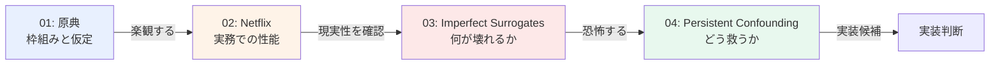
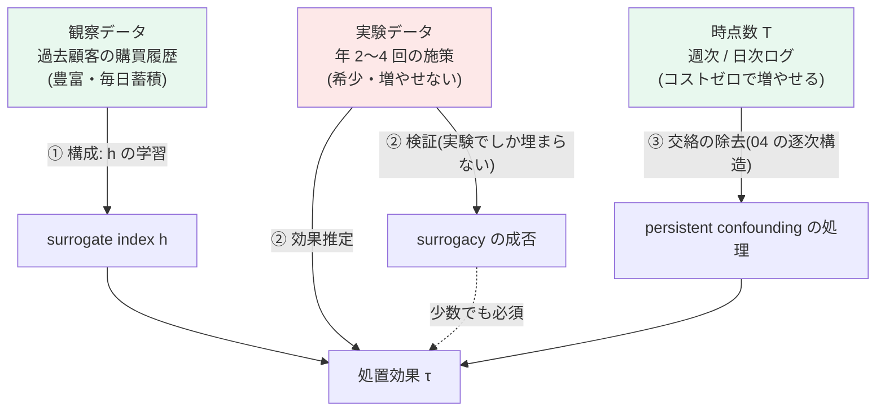
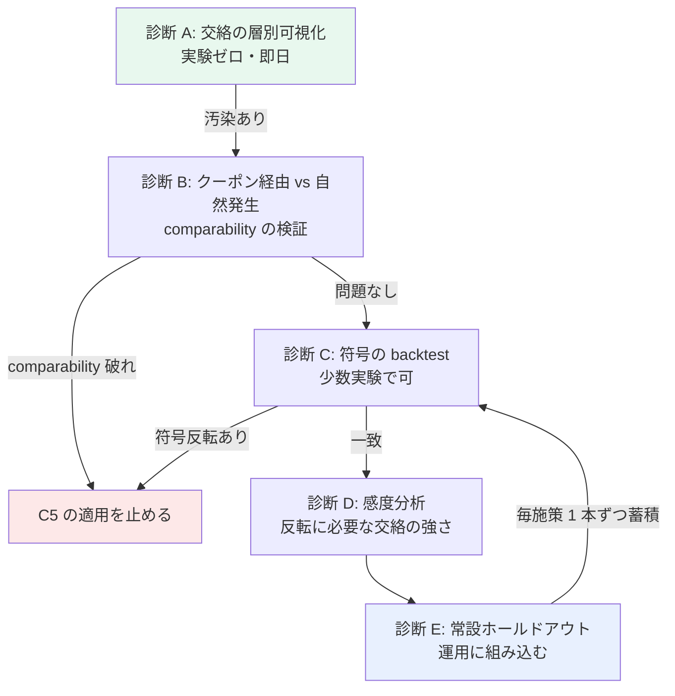

# C5: Surrogate / 長期効果の早期代理観測 — retrieval レポート

[← gather リソース一覧](../../../gather/20260715/c5/resources-surrogate.md)

本クラスタは「**結果を待つ時間を縮める**」ことで低頻度施策の実質的な学習速度を上げる方向を扱う。gather 段階で推奨された上位 4 本を精読した。

## レポート一覧

| # | タイトル | 著者 / 年 | 会場 | 役割 |
|---|----------|----------|------|------|
| [01](01-the-surrogate-index.md) | The Surrogate Index | Athey, Chetty, Imbens, Kang / 2019 | NBER w26463 / ReStud | **原典**。surrogate index の定義と surrogacy assumption |
| [02](02-netflix-200-ab-tests.md) | Evaluating the Surrogate Index Using 200 A/B Tests at Netflix | Zhang, Zhao, Dimakopoulou, Le, Kallus / 2023 | arXiv (stat.AP) | **実証**。意思決定ツールとしての性能、線形 auto-surrogate |
| [03](03-imperfect-surrogates-many-weak-experiments.md) | Long-Term Causal Inference with Imperfect Surrogates using Many Weak Experiments, Proxies, and Cross-Fold Moments | Bibaut, Kallus, Ejdemyr, Zhao / 2023 | arXiv (stat.ME) | **失敗モード**。surrogate paradox と JIVE |
| [04](04-persistent-confounding.md) | Long-term Causal Inference Under Persistent Confounding via Data Combination | Imbens, Kallus, Mao, Wang / 2025 | **JRSS-B 87(2), 362–388** | **緩和**。persistent confounding と逐次構造による識別 |

## 読む順序

**01 → 02 → 03 → 04** の順を推奨する。理由は以下の通り。

1. **[01](01-the-surrogate-index.md) で枠組みを掴む** — surrogate index の定義（$h(s,x) = \mathbb{E}[Y \mid S=s, X=x]$）と Prentice surrogacy assumption（$Y \perp\!\!\!\perp W \mid S, X$）を理解しないと後続の位置づけが分からない。「9 年 → 6 四半期、標準誤差 35% 減」という成功例で **楽観する**。
2. **[02](02-netflix-200-ab-tests.md) で実務性を確認する** — 線形 auto-surrogate という最小構成で意思決定の約 95% 一致。**複雑な手法に進む前の第一歩が正当化される**。
3. **[03](03-imperfect-surrogates-many-weak-experiments.md) で恐怖する** — 「01 の仮定を満たしていても符号を誤り得る」。楽観を破壊する役割。本課題で最も現実的な失敗モード（安売り常連化）の機序。
4. **[04](04-persistent-confounding.md) で救済策を得る** — 03 が示した交絡問題に対し、**実験本数ではなく短期成果の時点数**を資源として解く。本課題で最も実行可能性が高い候補。

**時間がない場合**: [02](02-netflix-200-ab-tests.md) → [03](03-imperfect-surrogates-many-weak-experiments.md) の 2 本。前者が「やってみる価値がある」を、後者が「ただし符号だけは必ず確かめろ」を与える。この 2 つが実務判断の最小セットにあたる。

## 低頻度性のパラドックス と 突破口

### パラドックスの再確認

gather 段階が特定した本クラスタ最大の論点は以下である。

> 「待ち時間を縮めたい理由（低頻度）」が「待ち時間を縮める手段（多数の過去実験からの学習）」を阻害している。

4 本を精読した結果、**このパラドックスは gather 段階の想定より深刻**であることが分かった。[02](02-netflix-200-ab-tests.md) はその最も鮮明な例示である。

> Netflix は **surrogate index が使えるかを検証するために、200 件の A/B テストで 63 日待った**。

本課題（年 2〜4 回）で同等の検証をするには **50〜100 年** かかる。単純な割り算である。そして [03](03-imperfect-surrogates-many-weak-experiments.md) は「many weak experiments」を IV として要求する。本課題の実験は **weak ではあるが many ではない**。few weak experiments では JIVE の漸近論が働かない。

### 突破口の評価: data combination は機能するか

gather が提案した突破口は以下だった。

> surrogate index の学習（$S$ から $Y$ を予測するモデル）は観察データで行い、処置効果の推定にのみ実験データを使う、という分業。

**結論から言えば、この分業は本物である。ただし gather が期待したほど広くは効かない。効く範囲を正確に切り分ける必要がある。**

surrogate index を実務投入するには 3 つの作業が要る。それぞれについて、観察データで代替できるかを判定する。

| 作業 | 内容 | 観察データで可能か | 根拠 |
|------|------|------------------|------|
| **① 構成** | $h(s,x) = \mathbb{E}[Y \mid S, X]$ の学習 | **○ 可能** | [01](01-the-surrogate-index.md) の識別式そのもの。$Y$ が確定した過去顧客がいれば実験は不要 |
| **② 検証** | $Y \perp\!\!\!\perp W \mid S, X$ の成否確認 | **✗ 不可能** | $W$ の外生的変動が要る。観察データの $W$ は交絡しており、原理的に代替できない |
| **③ 交絡の除去** | $S \to Y$ の交絡（surrogate paradox の原因）の処理 | **△ 条件付きで可能** | ここが分岐点。下記参照 |

#### ① 構成 — 突破口は本物

surrogate index の学習に実験は要らない。$Y$ が確定した過去顧客の履歴があれば $h$ は学習できる。本課題では **これは豊富にある**。施策の頻度は年 2〜4 回でも、顧客の購買履歴は毎日蓄積している。

さらに [02](02-netflix-200-ab-tests.md) の知見が効く。有効だったのは **線形 auto-surrogate**、すなわち「長期成果と同じ指標の早い断面」であった。本課題では

$$
\hat{Y}_{\text{6ヶ月LTV}} \;=\; \beta_0 + \sum_{t=1}^{4} \beta_t \cdot (\text{第 } t \text{ 週の購買額})
$$

という形になる。これは **過去顧客データだけで、今日から学習できる**。実験は 1 本も要らない。ここは突破口が完全に機能する領域である。

#### ② 検証 — 突破口は機能しない

しかし「$h$ が $Y$ をよく予測する」ことと「surrogate index が処置効果を正しく推定する」ことは **別物** である。前者は観察データで確認できるが、後者には $W$ が要る。

$h$ の $R^2$ が 0.8 でも、surrogacy assumption が破れていれば処置効果の推定は無意味である。**予測精度は surrogacy の証拠にならない** —— これは実装者が最も誤解しやすい点であり、[01](01-the-surrogate-index.md) の実装ステップ 4 で強調した。

観察データには $W$ の外生的変動がない。したがって「クーポンの効果はすべて $S$ を経由するか」という問いに、観察データは原理的に答えられない。**②は実験でしか埋まらない。**

> **突破口は半分しか救わない。構成は救われるが、検証は救われない。**

#### ③ 交絡の除去 — ここに本当の分岐点がある

[03](03-imperfect-surrogates-many-weak-experiments.md) が示した通り、$S \to Y$ の交絡は符号反転を引き起こす。そしてこの交絡は **観察データをいくら積んでも識別できない**（それが交絡の定義である）。

[03](03-imperfect-surrogates-many-weak-experiments.md) の処方は「多数の過去実験を IV として使う」であり、本課題では実行不能である。**ここでパラドックスは行き止まりに見える。**

**しかし [04](04-persistent-confounding.md) が別の道を開く。** 両者を並べると構造が見える。

| | [03](03-imperfect-surrogates-many-weak-experiments.md) | [04](04-persistent-confounding.md) |
|---|---|---|
| 交絡を断つ資源 | 実験の **本数** $E$ | 短期成果の **時点数** $T$ |
| 要求 | many weak experiments | 複数時点の短期成果（1 実験でよい） |
| 本課題での調達 | ✗ 年 2〜4 回が上限。物理的に増やせない | ○ **日次・週次ログは既にある。コストゼロ** |

**これが本レポートの中心的な発見である。**

> 低頻度性が制約するのは施策の **本数** であって、1 施策あたりの **観測の細かさ** ではない。
> [04](04-persistent-confounding.md) は後者を資源とする。したがって **低頻度性の影響を受けない**。

年 2 回しか施策を打てない企業でも、1 回の施策の後に週次・日次の購買ログを取ることは何のコストもかからない。$S = (S_1, S_2, \dots, S_T)$ の $T$ は、施策の頻度とは独立に増やせる。**「本数が足りないなら細かさで代替する」** —— これが本課題における data combination の具体的な内容である。

### 修正後の突破口

以上を統合すると、gather の突破口は以下のように **修正・具体化** される。

**3 つの資源の性質が異なることが要点である。**

- **観察データ（緑）**: 豊富。①を担う。
- **時点数（緑）**: コストゼロで増やせる。③を担う。**低頻度性の影響を受けない。**
- **実験データ（赤）**: 希少。増やせない。②と効果推定を担う。**ここだけがボトルネック。**

したがって戦略は明快である。**実験データを②と効果推定にだけ使い、①と③は実験を消費しない資源で賄う。** 少数の実験を①や③に浪費しない。

### 突破口の限界 —— 正直な評価

以上は希望的観測ではないが、以下の留保が要る。

**1. ②は本当に埋まらない。実験本数の下限は存在する。**

surrogacy の検証には最低限の実験が要る。本課題で必要なのは 200 本ではないが、**ゼロでもない**。現実的には「長期成果が確定した過去の施策」が数本あれば、符号の一致だけは確認できる。**その数本が本当にあるかを最初に数え上げるべき**であり、なければ C5 全体が成立しない。これが最初にやるべき作業である（→ [03](03-imperfect-surrogates-many-weak-experiments.md) 実装ステップ 4）。

**2. [04](04-persistent-confounding.md) の逐次構造の要件が満たされるかは未確認**

3 つの識別戦略が逐次構造に何を仮定するかが **本文未取得のため未確認**。本課題の週次購買はクーポン使用期限で人為的に区切られる（駆け込み → 反動）非定常性を持ち、これが仮定と整合するかは不明である。**「時点数で代替できる」という本レポートの中心的主張は、この点の確認に依存している。** PDF 精読が最優先タスクである理由がこれにあたる。

**3. comparability の破れは突破口の前提を直撃する**

①（観察データで $h$ を学習）が成立するには、観察サンプルで学習した $S \mapsto Y$ の関係が実験サンプルでも成り立つ必要がある（comparability）。ところが **クーポン経由の初回購入と自然発生の初回購入では、その後の LTV への繋がり方が違う** と考える方が自然である。同じ $S$ の値でも、そこに至る経路が違えば $\mathbb{E}[Y|S]$ が違う。

**これが破れると突破口の①も崩れる**。すなわち観察データで $h$ を学習すること自体が正当化されなくなる。安売り常連化とは、まさに comparability の破れの別名でもある。→ 検証は下記「surrogate paradox の検知方法」の診断 B。

**4. 施策の異質性は突破口では救えない**

施策ごとに対象・訴求・金額が違う（surrogate の妥当性は intervention-specific）という問題は、観察データでも時点数でも救えない。介入タイプごとに index を分けるなら、必要な実験本数がさらに増える。**この問題には答えがない**というのが正直な評価である。当面は「クーポン施策」という 1 つの介入タイプに限定して index を構成し、他タイプへの転用を諦めるのが現実的である。

### 総合判定

| 論点 | 判定 |
|------|------|
| data combination で **構成** を実験から解放できるか | **○ できる。突破口は本物** |
| data combination で **検証** を実験から解放できるか | **✗ できない。原理的に不可能** |
| data combination で **交絡の除去** を実験から解放できるか | **△ [04](04-persistent-confounding.md) の逐次構造が効けば可能。要件は未確認** |
| Netflix の 200 テストに相当するものが要るか | **✗ 要らない。ただしゼロでもない** |
| C5 は本課題で成立するか | **条件付きで成立**。①③を実験を使わない資源で賄い、少数の実験を②に集中させる設計なら可能 |

**一言で言えば**: gather の突破口は **正しいが不完全** だった。正しくは「構成は観察データで、交絡除去は時点数で、検証だけは実験で」という **三分割** である。gather は 2 番目の軸（時点数）を見落としており、[04](04-persistent-confounding.md) がそれを与える。この 3 つ目の資源の発見によって、必要な実験本数は「200 本」から「数本」へ落ちる。**それでもゼロにはならない。**

## surrogate paradox の検知方法

[03](03-imperfect-surrogates-many-weak-experiments.md) が示した通り、**処置がランダム化されており surrogate が完全媒介していてさえ符号を誤り得る**。本課題ではこれが安売り常連化として実在する。以下、**実験本数が少なくても実行できる順** に検知手段を並べる。

### 診断 A: 交絡の層別可視化（実験ゼロ・即日実行可）

観察データで、$S$（初月購買額）と $Y$（6 ヶ月 LTV）の関係を **関与度の代理変数** で層別する。

| 層別軸 | 具体例 |
|--------|--------|
| 会員年数 | 新規 / 1 年未満 / 1〜3 年 / 3 年以上 |
| 施策前の購買頻度 | RFM の F |
| 施策前の購買単価 | 定価購買比率 |

**判定**: 層内で $S$–$Y$ の関係が層間と大きく異なるなら、観察上の $S$–$Y$ 関係は **交絡に強く汚染されている**。特に **層内で関係が消える／反転する** なら危険信号である。

これは実験を 1 本も使わずに今日できる、最も情報量の多い診断である。

### 診断 B: クーポン経由 vs 自然発生の比較（comparability の直接検証）

**本課題で最も重要な診断。** 同じ $S$ の値を持つ顧客を、$S$ に至った経路で分けて $Y$ を比較する。

$$
\mathbb{E}\!\left[\,Y \mid S = s,\; \text{クーポン経由}\,\right] \;\overset{?}{=}\; \mathbb{E}\!\left[\,Y \mid S = s,\; \text{自然発生}\,\right]
$$

**判定**: 左辺が有意に小さければ、**それが安売り常連化の直接的な証拠**である。「同じ額を買った顧客でも、クーポンで買った人はその後の LTV が低い」という形で現れる。この場合、観察データで学習した $h$ を実験サンプルに当てはめること自体が正当化されない（comparability の破れ）。

**注意**: この比較自体が観察的であり交絡している（クーポンを受け取る顧客は無作為ではない）。過去にランダム化した施策があるなら、そこで見るのが望ましい。ただし交絡の方向を考えると、**この診断はむしろ保守的**である —— クーポンは優良顧客に配られがちなので、それでもなお左辺が低いなら、真の毀損はさらに大きい。

### 診断 C: 符号の一致だけを見る backtest（少数実験で可）

長期成果が確定した過去施策について、$\hat\tau_{\text{surrogate}}$ と $\hat\tau_{\text{direct}}$ を比較する。**効果量の一致は求めない。符号だけを見る。**

| | 直接測定: 正 | 直接測定: 負 |
|---|---|---|
| **surrogate: 正** | ○ 一致 | **✗ 致命的（安売り常連化を見逃す）** |
| **surrogate: 負** | △ 機会損失 | ○ 一致 |

**右上のセルが 1 つでも出たら C5 の適用を止める。** 効果量の精度で評価すると（RMSE 等）この非対称性が見えない。→ [02](02-netflix-200-ab-tests.md) の評価設計。

少数実験でも、**1 本ずつこの表を埋めていく**ことはできる。年 2〜4 回でも 3 年で 6〜12 本になる。

### 診断 D: 感度分析（少数実験下での現実的な落とし所）

実験本数が足りず [03](03-imperfect-surrogates-many-weak-experiments.md) の IV 推定が使えない場合、点推定を諦めて **反転に必要な交絡の強さ** を計算する。

> 「関与度による交絡が観察された $S$–$Y$ 関係の何 % を説明すれば、結論の符号が反転するか」

この記述は **実験本数によらず得られる**。「30% で反転する」なら危険（現実的にあり得る水準だから）、「200% 必要」なら安全、といった判断ができる。Rosenbaum 型の感度分析の発想である。**少数実験下での最も現実的な運用**にあたる。

### 診断 E: 常設ホールドアウト（運用設計・最重要）

**手法で防げないなら、運用で検知する。**

各施策で一定割合を非処置のまま保持し、**長期成果まで必ず追跡する**。surrogate index で早期に判断して次の施策を設計しつつ、答え合わせの材料を残す。

これは C5 の価値（待ち時間短縮）を否定するように見えるが、そうではない。

- **意思決定は surrogate index で前倒しする**（待たない）
- **答え合わせは裏で走らせる**（待つが、意思決定は止めない）

この二層構造により、**少数実験を毎回 1 本ずつ増やす**唯一の仕組みが得られる。本課題では実験が希少である以上、**1 本たりとも答え合わせに使わずに捨ててはならない**。これが本課題における最も重要な運用設計である。

### 検知手段の優先順位

**A → B は実験ゼロで今日できる。ここで止まる可能性が十分にある**（診断 B で comparability が破れていれば C5 は成立しない）。**先に A・B を回してから実験の設計に進むべき**であり、逆順にすると希少な実験を無駄にする。

## 未確認事項

本 retrieval では 4 本すべての abstract・書誌情報を一次ソースから確認したが、**本文 PDF はいずれも取得できていない**（[01](01-the-surrogate-index.md) の Opportunity Insights PDF はネットワーク制約で取得不可、[02](02-netflix-200-ab-tests.md) の arXiv PDF は解析不能）。以下は未確認である。

| 論文 | 未確認事項 | 影響 |
|------|-----------|------|
| [01](01-the-surrogate-index.md) | バイアスの特徴づけの具体形、**追加成果を用いた仮定検証手法の手続き**、ReStud の巻号・DOI・掲載日 | 検証手法は本課題の焦点に直結。**最優先で補完** |
| [02](02-netflix-200-ab-tests.md) | **79% / 65% がそれぞれ何の指標か**（abstract 原文は "79% and 65% recall"）、gather が記載した「誤 launch ゼロ」の真偽、限界の記述 | 誤 launch ゼロは C5 の安全性の根拠。**真偽の確認が必須** |
| [03](03-imperfect-surrogates-many-weak-experiments.md) | 「many」が想定する実験本数 $E$ の目安、実証評価の設定と数値、公開実装の有無 | 本課題での適用可否を直接決める |
| [04](04-persistent-confounding.md) | **3 つの識別戦略の具体的内容と逐次構造への仮定**、推定量の形、semi-synthetic 実験の数値、GitHub 実装の中身 | **本レポートの中心的主張（時点数で代替）がこれに依存**。最優先 |

**gather 段階の記載との差異**: [02](02-netflix-200-ab-tests.md) の「precision 79%、recall 65%」および「誤って負の施策を launch したケースはゼロ」は、arXiv の abstract には確認できなかった。gather がどの情報源に基づいたかは不明であり、**本文で確認するまでこの 2 点を意思決定の根拠にしてはならない**。

## 次のアクション

1. **4 本の本文 PDF を入手する** — 特に [04](04-persistent-confounding.md)（arXiv v5）と [01](01-the-surrogate-index.md)。本レポートの主張の検証に必須。
2. **診断 A・B を回す** — 実験ゼロ・即日実行可能。ここで C5 の適用可否がほぼ決まる。
3. **長期成果が確定した過去施策を数え上げる** — ②（検証）に使える実験が何本あるか。ゼロなら C5 は成立しない。
4. **常設ホールドアウトの運用を設計する** — 診断 E。今後の全施策に組み込む。早く始めるほど蓄積が早い。
5. **線形 auto-surrogate を観察データで学習してみる** — [02](02-netflix-200-ab-tests.md) の最小構成。実験を消費しないので、上記と並行してよい。
