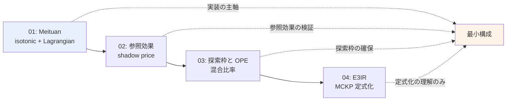
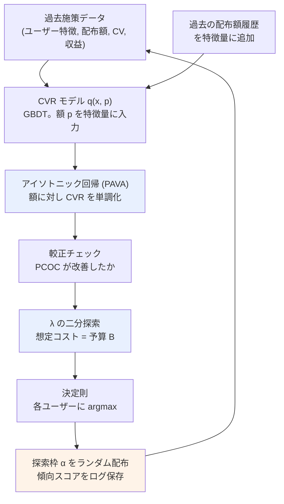

# C6: 実務適用 — クーポン額・予算制約・逐次配布 — 精読レポート

[← gather 一覧](../../../gather/20260715/c6/resources-practical-coupon.md)

gather フェーズの「retrieval 推奨」上位 4 本を精読した。各論文は arXiv の HTML 全文（`arxiv.org/html/...`）から本文・数式・実験数値を確認している。**PDF 版は圧縮ストリームのため取得できず、HTML 版で代替した**。確認できなかった項目は各レポート内で「未確認」と明記している。

## レポート一覧

| # | タイトル | 会場 / 年 | 検証規模 | 本課題との距離 |
|---|---------|----------|---------|--------------|
| [01](01-data-driven-real-time-coupon-allocation.md) | Data-Driven Real-time Coupon Allocation in the Online Platform | arXiv 2024（査読状況未確認） | 学習 300 万件 / フィールド 340 万人 | **実装の主軸** |
| [02](02-personalized-promotions-in-practice.md) | Personalized Promotions in Practice: Dynamic Allocation and Reference Effects | arXiv 2025（査読状況未確認） | 学習 3,240 万 customer-day / A/B 2,000 万人 | **問題設定が最も近い** |
| [03](03-balancing-immediate-revenue-and-future-ope.md) | Balancing Immediate Revenue and Future Off-Policy Evaluation in Coupon Allocation | arXiv 2024（出版状況未確認） | 合成 1 万ユーザー / 実データ（規模未確認） | **唯一データ規模が一致** |
| [04](04-e3ir-end-to-end-cost-effective-incentive-recommendation.md) | End-to-End Cost-Effective Incentive Recommendation under Budget Constraint with Uplift Modeling (E3IR) | RecSys 2024 | Criteo 203 万 / Meituan 120 万（**全てオフライン**） | 定式化の土台 |

## 読む順序

1. **01（Meituan）を最初に読む**。「XGBoost + アイソトニック回帰 + 双対変数 $\lambda$」という最小構成が、深層モデルなしで 110 都市・1 億人に実装された事実を押さえる。式 8 の $j^*(\lambda) = \arg\max_j (v_{ij} - \lambda \hat{q}_{ij}(\cdot))$ が本クラスタ全体の到達点である。
2. **02（参照効果）で問題設定を確認する**。割引 5 水準・$\lambda_t$ を人間が手で設定して +4.5%。01 と同型の決定則に独立に到達している点を確認しつつ、**参照効果という 01 が見落とす論点**を受け取る。
3. **03（探索と OPE）で低頻度施策固有の制約に向き合う**。01/02 は「配る」側の話だが、本課題では「次回のためのデータを作る」ことが同じくらい重要である。BIPS の分母が探索の必要性を数式で語る。
4. **04（E3IR）は定式化の土台としてのみ読む**。MCKP（式 3）が 01/02 の $\lambda$ の出所であることを理解すれば十分。**微分可能 ILP レイヤは本課題では採用しない**。

## 3 軸の充足状況

gather の 3 軸（連続処置 / 予算制約 / 逐次性）に対する、**精読で確認した**充足状況。◎ = 中心的に扱う、○ = 扱うが主眼でない、× = 扱わない。

| # | 手法 | 連続処置（額の内挿・外挿） | 予算制約 | 逐次性・時間構造 | 検証規模 | 実装コスト |
|---|------|------------------------|---------|----------------|---------|-----------|
| 01 | Real-time Coupon Allocation | ◎ XGBoost に額を特徴量入力 + PAVA で単調化 | ◎ $\lambda$ 1 個 + PID。Prop. 1/2 の理論保証あり | × 各顧客独立・単発 | 300 万件 / 340 万人（**フィールド実験**） | **低**（ソルバ不要） |
| 02 | Personalized Promotions | ○ 離散 5 水準。$\beta(x)=\beta^\top x$ で感応度を線形化 | ◎ $\lambda_t$ 1 個。**人間が手で設定** | ◎ 参照効果 $x_{it}=\max\{v_{i,t-\ell},\dots\}$、$\ell$-up-1-down 定理 | 3,240 万 c-day / A/B 2,000 万人 | **低**（二分探索のみ） |
| 03 | Balancing Revenue and OPE | × 行動は二値 $\{0,1\}$ | ○ 前提として存在。割当自体は範囲外 | ◎ 今期の探索が次期 OPE を規定（2 期間） | **合成 1 万ユーザー** | 低（Optuna NSGA-II） |
| 04 | E3IR | ◎ 増分累積和 + 非負性で単調性を構造保証 + Lipschitz 平滑性 | ◎ 微分可能 ILP レイヤ（MCKP） | × 単発割当 | Criteo 203 万 / Meituan 120 万（**全てオフライン**） | **高**（微分可能 ILP） |

**gather の findings に対する検証結果**：

| gather の finding | 精読後の判定 |
|---|---|
| **1. どの手法も 3 軸を同時に満たさない** | **確認された**。4 本のうち 2 軸を満たすのが最大（02 が連続処置 ○ + 予算 ◎ + 逐次性 ◎ で最も網羅的だが、額は離散 5 水準で内挿を扱わない）。01 と 04 は逐次性 ×、03 は連続処置 ×。 |
| **2. 予算制約は単一の双対変数に収束** | **強く確認された**。01 の $j^*(\lambda)=\arg\max_j(v_{ij}-\lambda\hat{q}_{ij}(p_b-p_j))$ と 02 の $v_{it}\in\arg\max_v(1-\lambda_t v)q(x_{it},v)$ は**独立の研究グループが同型の決定則に到達**している。04 の MCKP（式 3）がその出所。**ソルバなしの閾値調整で運用可能**であることは、02 が「担当者が毎日手で $\lambda_t$ を設定して +4.5%」という形で実証済み。01 の Proposition 2（提示価格は $\lambda$ に単調）が二分探索の正当性を保証する。 |
| **3. 単調性は複数論文が独立に到達** | **確認された。しかも実装は 3 通りある**。01 = 後処理 PAVA（最軽量）、02 = 線形処置効果 $\beta(x)=\beta^\top x$（結果的に $\beta(x)>0$ が **99.5%**）、04 = 非負増分の累積和（構造的保証）。**深層モデルは 3 通りのうち 1 つ（04）にしか要らない**。01 は単調化の効果が AUC ではなく **PCOC 0.971 → 0.982**（較正）として現れると報告しており、割当が CVR の絶対値を使う以上これは重要。 |

**追加で判明した重要事項**：

- **gather の E3IR に関する記述に誤りがあった**。gather は E3IR が「Meituan の online A/B で注文 +0.53% / GMV +0.65%」と記載するが、**E3IR は online A/B を一切行っていない**（"all experiments are conducted in an offline setting"）。この数値は gather のリソース 12（Hidden Representation Clustering）のもの。gather 自身がリソース 12 の項で「01 と同一数値である」ことに気づいて疑問を呈していたが、**原因は同一ベースラインではなく転記ミスと見られる**。詳細は[レポート 04](04-e3ir-end-to-end-cost-effective-incentive-recommendation.md) 冒頭の訂正を参照。
- **参照効果は実データで裏付けられている**（02）。ランダム化割当 15 万人 × 11 日で、参照値が小さいほど購入率が**記憶長に応じ 7〜137% 増加**。ただし検証は**日次スケール**（$\ell \in \{3,4,5,7\}$ 日）であり、**数ヶ月間隔での参照効果の有無は未確認**。
- **03 だけが本課題と同じデータ規模（合成 1 万ユーザー）で検証されている**。他の 3 本は 120 万〜3,240 万。
- **01 と 04 の学習データはいずれも RCT ないしフィールド実験由来**。非ランダムな観測データからの学習の成立性は、4 本のいずれも検証していない。

## 低頻度・少数施策でも成立する最小構成

gather の仮説は「isotonic + 双対変数」であった。**精読の結果、この仮説は支持される**。根拠は 01 が深層モデルなしの XGBoost + PAVA + $\lambda$ で 110 都市・1 億人に実装され年間 CNY 800 万の利益を出していること、および 02 が $\lambda_t$ の手動設定で +4.5%（p<0.01）を得ていることである。**ただし 2 点の修正と 1 点の追加を要する**。

### 構成

### 具体的な第一歩

1. **クーポン額を 3〜5 水準に離散化する**（02 に倣う。02 は 10/12/15/17/20% off の 5 水準で 2,000 万人を運用）。連続値として扱うより、水準ごとのサンプルを厚くする方が本課題では優先。額は**モデルの特徴量としては連続値**で入れ、**候補集合としては離散**にする。

2. **CVR モデル $q(x,p)$ を GBDT で 1 本だけ作る**。額 $p$ を明示的な特徴量として入力する single-model 構成（01 と同じ）。額ごとにモデルを分けない。特徴量は 01 の約 200 個・02 の 61 個に対し、**本課題では 10〜30 に絞る**。
   - **過去の配布額履歴を特徴量に必ず含める**（02 が実際にそうしている）。参照効果が本課題で生きているかは未知だが、入れるコストは低く、入れない場合のバイアスは系統的である。

3. **PAVA で単調化する**。各ユーザーについて候補額全てで予測し、額の昇順に `IsotonicRegression(increasing=True)` を適用。$O(|J|)$ の後処理であり、水準が 3〜5 個なら計算コストはゼロに等しい。**本課題で最初に試すべき最も費用対効果の高い施策**（gather 論点 3 を精読が支持）。

4. **PCOC で効果を確認する**。PCOC = 予測 CVR 合計 / 実績 CVR 合計。01 では単調化で 0.971 → 0.982。**AUC ではなく較正を見る**——割当が $\hat{q}$ の絶対値を使うため。ここが改善しないなら単調性が効いていない。

5. **$\lambda$ を二分探索で決める**。$\lambda=1$（＝期待収益最大化、02 の性質）から出発し、想定償還コストが予算 $B$ を超えるなら $\lambda$ を上げる。01 の Proposition 2（提示価格は $\lambda$ に非減少）が探索の正当性を保証する。**ソルバ不要、for ループのみ**。数ヶ月に一度なら施策ごとに 1 回決めるだけでよい（02 は毎日これを人間がやっている）。

6. **決定則を適用する**：各ユーザーに $\arg\max_{p} (\text{収益}(p) - \lambda \cdot \text{コスト}(p))$。

7. **探索枠 $\alpha$ を確保し、傾向スコアをログに残す**（03）。**これが最小構成に対する最大の追加要求**。数ヶ月に一度の施策では探索の機会費用が高いが、**探索ゼロだと BIPS の分母がゼロになり次回の評価が原理的に不可能**になる。5〜10% の枠から始め、**配布確率を必ず保存する**（実装上最も忘れられやすい）。

### gather 仮説からの修正点

- **修正 1: $\lambda$ は安全側に倒す**。01 の Proposition 1（$\hat{\lambda}\to\lambda^*$）は $|I_0|\to\infty$ の漸近論であり、本課題の規模では $\hat{\lambda}$ 自体に推定誤差が乗る。Proposition 2 より $\hat{\lambda}<\lambda^*$ なら実行不能（予算超過）なので、**やや高め（割引を渋る側）に設定する**。
- **修正 2: 単調化だけでは処置効果の分散は下がらない**。PAVA は額に対する CVR の順序を保証するが、**処置効果そのものの推定分散には効かない**。02 の $\beta(x)=\beta^\top x$（ベースラインは GBDT で自由に、**割引感応度だけ線形に縛る**）が、少数サンプルへの直接の回答として PAVA を補完する。**$\beta(x)>0$ が 99.5% という 02 の結果は、線形化が単調性をほぼ自動的にもたらすことも示唆する**——つまり修正 2 は代替案でもある。
- **追加: 参照効果の予備検証を最優先で行う**。過去施策データで「前回配布額 × 今回 CVR」の相関を施策間隔別に見る。**数ヶ月間隔で相関が消えるなら、逐次性の軸は本課題では無視でき、問題は 2 軸に縮む**（＝上記の最小構成で 3 軸中 2 軸を満たす）。残るなら履歴の特徴量化が必須。02 の $\ell$-up-1-down 定理は日次配布（$\ell \in \{3,4,5,7\}$ 日）が前提であり、**本課題の施策間隔が $\ell$ を超えるなら理論的根拠を失う**ため、当面採用しない。

### 採用しないもの

| 手法 | 理由 |
|------|------|
| 微分可能 ILP レイヤ（04） | 実装コストが 01/02 と桁違い。得られるのは「予測と意思決定の整合」だが、01/02 は $\lambda$ の argmax だけで実運用の成果を出している |
| $\ell$-up-1-down 周期方策（02） | 日次配布・$\ell \le 7$ 日が前提。施策間隔が数ヶ月なら参照値がリセットされ根拠を失う |
| PID コントローラ（01） | リアルタイム到着への対応。バッチ配布の本課題では不要 |
| 深層 uplift モデル全般 | データ規模のギャップ。01 は XGBoost、02 は GBDT + 線形で足りている |
| 額の軸への探索枠拡張（03） | 行動数が増えると BIPS の分散が急増。まず二値（配る/配らない）で回す |

### 残る未解決点

- **推定不確実性を最適化に組み込む手法が 4 本のいずれにもない**（gather 論点 8）。全て点推定を信じて $\lambda$ ないし ILP を解く。gather のリソース 14（Robust portfolio optimization）が次の精読候補として重要度を増した。
- **非ランダムな観測データからの学習の成立性**は 4 本とも未検証（01/04 は RCT ないしフィールド実験、02 は参照効果の検証にランダム化枠 15 万人を使用、03 は合成データ）。本課題の過去履歴が「効きそうな人に厚く配る」運用なら、gather のリソース 06（UniMVT、交絡バイアス）の確認が要る。
- **数ヶ月スケールでの参照効果の有無**は文献からは決まらない。自前のデータで測るしかない（上記「追加」）。
